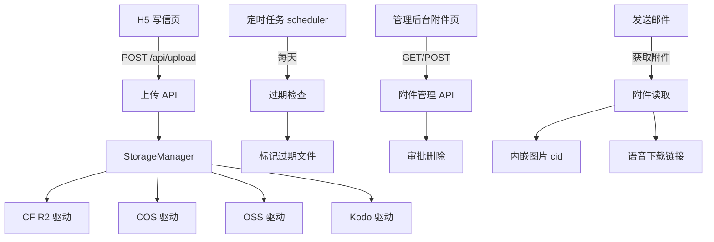
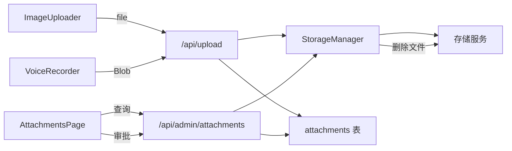
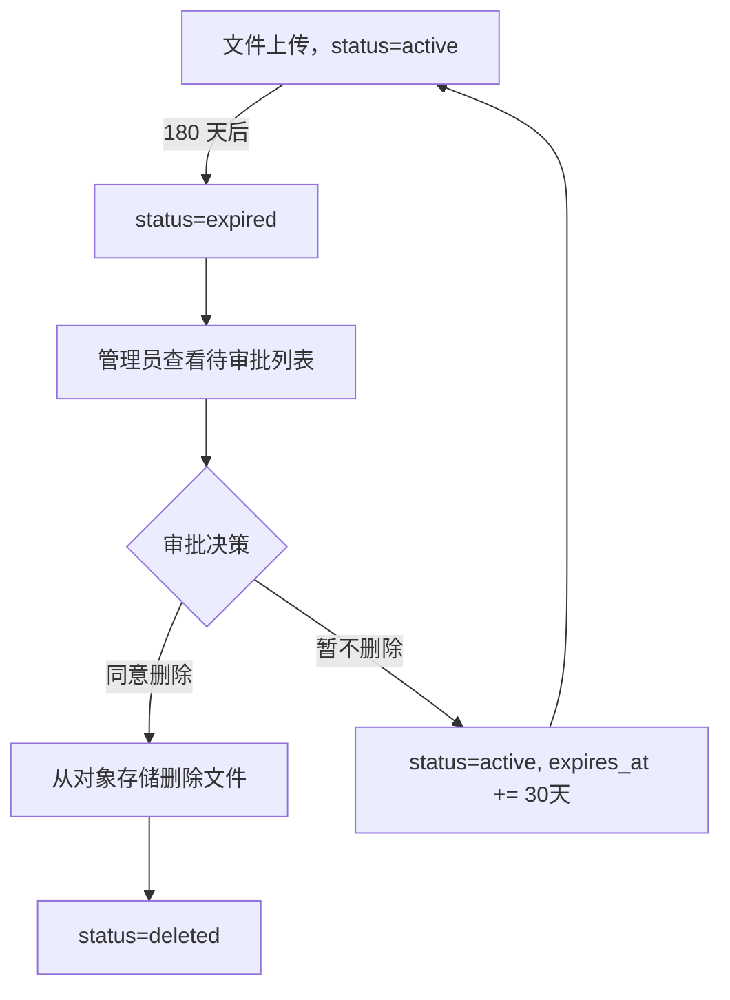

# 技术设计: 信件多媒体附件功能

Feature Name: media-attachments
Updated: 2026-07-14

## 描述

为时光邮局 H5 添加图片上传和语音录制上传功能，后端支持 CF R2、腾讯云 COS、阿里云 OSS、七牛云 Kodo 四种对象存储，文件保留 180 天，过期后需管理员审批才删除。

## 架构



## 数据模型

### 数据库变更

新增 `attachments` 表：

```sql
CREATE TABLE IF NOT EXISTS attachments (
  id TEXT PRIMARY KEY,
  letter_id TEXT NOT NULL,
  type TEXT NOT NULL CHECK(type IN ('image', 'audio')),
  file_name TEXT NOT NULL,
  file_size INTEGER NOT NULL,
  mime_type TEXT NOT NULL,
  storage_provider TEXT NOT NULL,
  storage_key TEXT NOT NULL,
  storage_url TEXT,
  status TEXT NOT NULL DEFAULT 'active'
    CHECK(status IN ('active', 'expiring', 'expired', 'pending_delete', 'deleted')),
  uploaded_at TEXT NOT NULL DEFAULT (datetime('now')),
  expires_at TEXT NOT NULL,
  deleted_at TEXT,
  FOREIGN KEY (letter_id) REFERENCES letters(id) ON DELETE CASCADE
);

CREATE INDEX IF NOT EXISTS idx_attachments_letter_id ON attachments(letter_id);
CREATE INDEX IF NOT EXISTS idx_attachments_status ON attachments(status);
CREATE INDEX IF NOT EXISTS idx_attachments_expires_at ON attachments(expires_at);
```

新增 `storage_configs` 设置键：
- `storage_provider`: 当前选中的存储服务 (r2/cos/oss/kodo)
- `storage_r2_config`: CF R2 配置 JSON
- `storage_cos_config`: 腾讯云 COS 配置 JSON
- `storage_oss_config`: 阿里云 OSS 配置 JSON
- `storage_kodo_config`: 七牛云 Kodo 配置 JSON

每条配置 JSON 结构：
```json
{
  "endpoint": "https://xxx.r2.cloudflarestorage.com",
  "accessKeyId": "encrypted:...",
  "secretAccessKey": "encrypted:...",
  "bucket": "my-bucket",
  "region": "auto",
  "customDomain": "https://cdn.example.com",
  "publicUrlPrefix": "https://pub-xxx.r2.dev"
}
```

### 加密存储

密钥使用 AES-256-GCM 加密后存入 settings 表。加密密钥从环境变量 `STORAGE_ENCRYPTION_KEY` 读取，若无则自动生成并打印到启动日志。

## 组件和接口

### 1. 统一存储抽象层 (`src/lib/storage/types.ts`)

```typescript
interface StorageConfig {
  endpoint: string;
  accessKeyId: string;
  secretAccessKey: string;
  bucket: string;
  region: string;
  customDomain?: string;
  publicUrlPrefix?: string;
}

interface StorageDriver {
  name: string;
  upload(fileName: string, buffer: Buffer, contentType: string): Promise<UploadResult>;
  delete(key: string): Promise<void>;
  getUrl(key: string): Promise<string>;
}

interface UploadResult {
  key: string;
  url: string;
  provider: string;
}
```

### 2. 四个驱动实现

- `src/lib/storage/r2.ts` — 使用 `@aws-sdk/client-s3`（R2 兼容 S3 API），调用 S3 `PutObjectCommand`
- `src/lib/storage/cos.ts` — 使用 `cos-nodejs-sdk-v5`，调用 `putObject`
- `src/lib/storage/oss.ts` — 使用 `ali-oss`，调用 `put`
- `src/lib/storage/kodo.ts` — 使用 `qiniu`，调用 `formUploader.put`

### 3. StorageManager (`src/lib/storage/manager.ts`)

```typescript
export function getStorageManager(): StorageDriver {
  const provider = getSetting('storage_provider', 'r2');
  const config = JSON.parse(getSetting(`storage_${provider}_config`, '{}'));
  return createDriver(provider, decryptConfig(config));
}
```

### 4. 上传 API (`src/app/api/upload/route.ts`)

- `POST /api/upload` — 接收 multipart/form-data，字段 `file` + `letter_id`
- 返回 `{ id, url, type, file_name, file_size }`

### 5. 附件管理 API (`src/app/api/admin/attachments/route.ts`)

- `GET /api/admin/attachments?status=active|expiring|expired|pending_delete&page=1`
- `POST /api/admin/attachments/approve` — body: `{ ids: string[] }` 审批删除
- `POST /api/admin/attachments/extend` — body: `{ ids: string[] }` 延长 30 天

### 6. 前端组件

- `src/components/ImageUploader.tsx` — 图片选择/拖拽、缩略图网格、删除
- `src/components/VoiceRecorder.tsx` — 录音控制、声波动画、播放预览
- `src/app/admin/attachments/page.tsx` — 附件管理页面（统计卡片、筛选列表、审批操作）



## 前端详细设计

### 写信页改动 (`src/app/write/page.tsx`)

在表单底部（"发送时间"字段下方）增加附件区域：

1. **图片上传**：点击 `+` 按钮选择文件，网格展示缩略图（3 列），每张图右上角有删除按钮。限制 9 张、单张 20MB。
2. **语音录制**：一个录音按钮 + 时长显示 + 已录制音频播放条。限制 1 条、最长 180 秒。
3. 上传流程：用户选择文件 → 即刻调用 `/api/upload` → 得到 `attachment_id` 列表 → 提交信件时附带 `attachment_ids`。

### 语音录制实现

使用浏览器 `MediaRecorder` API：

```typescript
const stream = await navigator.mediaDevices.getUserMedia({ audio: true });
const recorder = new MediaRecorder(stream, { mimeType: 'audio/webm;codecs=opus' });
const chunks: Blob[] = [];
recorder.ondataavailable = (e) => chunks.push(e.data);
recorder.onstop = async () => {
  const blob = new Blob(chunks, { type: 'audio/webm' });
  await uploadAudio(blob);
};
recorder.start();
setTimeout(() => recorder.stop(), 180000); // 最多 180 秒
```

### 邮件内嵌图片

在 `buildEmailHtml` 中，对图片附件使用 `cid` 方式嵌入：

```typescript
const attachments = await getLetterAttachments(letterId);
const mailAttachments = imageAttachments.map((att, i) => ({
  filename: att.file_name,
  path: att.storage_url,
  cid: `img_${i}@timepost`,
}));
// HTML 中: 
```

## 定时任务

在 `scripts/scheduler.ts` 中增加每日凌晨 3:00 的过期检查任务：

```typescript
cron.schedule('0 3 * * *', async () => {
  const db = getDb();
  // 标记即将过期（距过期 < 7 天）
  db.prepare(`
    UPDATE attachments SET status = 'expiring'
    WHERE status = 'active'
      AND expires_at <= datetime('now', '+7 days')
  `).run();
  // 标记已过期
  db.prepare(`
    UPDATE attachments SET status = 'expired'
    WHERE status IN ('active', 'expiring')
      AND expires_at <= datetime('now')
  `).run();
});
```

## 审批删除流程



## 错误处理

| 场景 | 处理 |
|------|------|
| 存储服务不可用 | 上传 API 返回 503，提示"存储服务暂时不可用" |
| 文件超过大小限制 | 上传 API 返回 413，提示"文件大小超出限制" |
| 存储配置未填写 | 上传 API 返回 400，提示"请先配置存储服务" |
| 删除时文件已不存在 | 忽略错误，仅更新数据库状态 |
| 录音权限被拒 | 前端捕获 `NotAllowedError`，提示用户授权 |

## 测试策略

1. 单元测试：StorageManager 各驱动的 mock 测试
2. API 测试：上传/下载/删除/审批的集成测试
3. 前端测试：ImageUploader 和 VoiceRecorder 组件渲染测试
4. 定时任务测试：手动触发过期检查验证状态流转

## 依赖安装

```bash
npm install @aws-sdk/client-s3 @aws-sdk/s3-request-presigner cos-nodejs-sdk-v5 ali-oss qiniu
```

## 文件结构

```
src/
├── lib/
│   └── storage/
│       ├── types.ts        # 接口定义
│       ├── manager.ts      # StorageManager
│       ├── crypto.ts       # AES 加解密
│       ├── r2.ts           # CF R2 驱动
│       ├── cos.ts          # 腾讯云 COS 驱动
│       ├── oss.ts          # 阿里云 OSS 驱动
│       └── kodo.ts         # 七牛云 Kodo 驱动
├── components/
│   ├── ImageUploader.tsx   # 图片上传组件
│   └── VoiceRecorder.tsx   # 语音录制组件
└── app/
    ├── api/
    │   ├── upload/
    │   │   └── route.ts    # 上传 API
    │   └── admin/
    │       └── attachments/
    │           └── route.ts # 附件管理 API
    ├── write/
    │   └── page.tsx         # 写信页（改造）
    └── admin/
        └── attachments/
            └── page.tsx     # 附件管理页（新建）
```

## References

- [^1]: CF R2 S3 兼容 API - https://developers.cloudflare.com/r2/api/s3/api/
- [^2]: 本项目 `src/lib/db.ts` - 当前数据库表结构
- [^3]: 本项目 `src/lib/mailer.ts` - 当前邮件发送逻辑
- [^4]: 本项目 `scripts/scheduler.ts` - 定时任务入口
